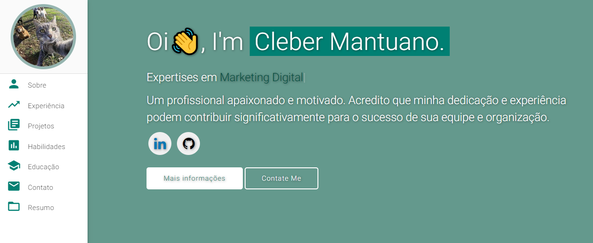

# Portfólio pessoal ⚡️ 
> Um modelo de portfólio limpo, bonito e responsivo para desenvolvedores de software!

> https://ktopdelinha.github.io

 

### Prévia do site

 
  <kbd>
    
  </kbd>

⭐ Estrela no meu GitHub — ajuda muito! ⭐

## Recursos 📋

Totalmente responsivo ⚡️
HTML5 e CSS3 válidos ⚡️
Animação de digitação usando Typed.js ⚡️
Fácil de modificar ✏️

## Instalação e implantação 📦

Clone o repositório e modifique o conteúdo de index.html de acordo com suas necessidades.
Adicione ou remova imagens do diretório varadbhogayata.github.io/assets/img/ conforme necessário.
Recomendo usar o GitHub Pages para implantar o site da maneira MAIS FÁCIL. 🚀
Para implantar seu site, primeiro você precisa criar um repositório do GitHub com o nome <seu-nome-de-usuário-do-github>.github.io. Não use nenhum outro nome.
Envie o código gerado para o branch principal deste repositório.
<b>OBSERVAÇÃO:</b> certifique-se de definir o analyticsId de sua conta do Google Analytics dentro da tag de script do Google Analytics, se quiser usar sua própria conta do Google Analytics.

## Seções 📚

Sobre mim 👤
Experiência 💼
Projetos 💻
Habilidades 💪
Educação 🎓
Informações de contato 📞
Currículo 📄

## Para ver um exemplo ao vivo, 👉 **[click aqui](https://ktopdelinha.github.io/)**

## Tools Used 🛠️
* [<b>GitHub Pages</b>](https://create-react-app.dev/docs/deployment/#github-pages) - GitHub Pages - Para hospedar meu site estático (HTML, CSS, JS).
* [<b>Materialize</b>](https://materializecss.com/) - Materialize - Um framework CSS para obter os componentes do Material Design do Google.
* [<b>Typed.js</b>](https://mattboldt.com/demos/typed-js/) - Typed.js - Biblioteca JavaScript

## Contribuindo 💡
#### Etapa 1

- **Opção 1**
    - 🍴 Fork this repo!

- **Opção 2**
    - 👯 Clone this repo to your local machine.

#### Etapa 2

- **Crie seu código** 🔨🔨🔨

#### Etapa 3

- 🔃 Crie um novo pull request.

**Licença 📄**

Este projeto é licenciado sob a Licença MIT - consulte o arquivo [LICENSE.md](./LICENSE) para obter detalhes.
